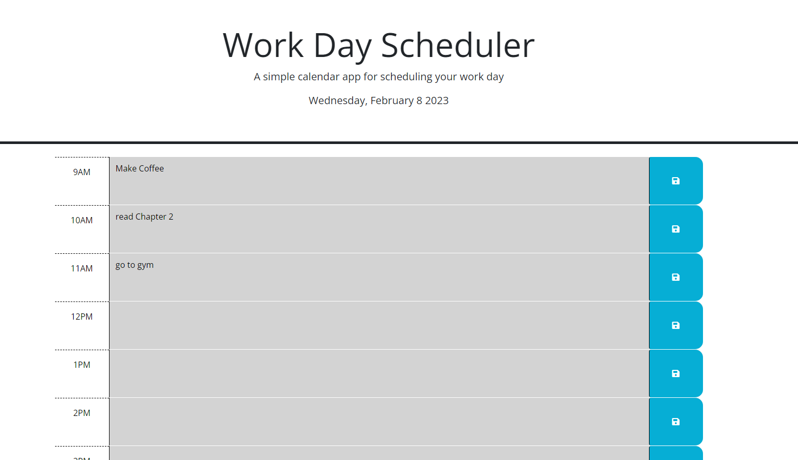

# daily_planner
coding bootcamp project 5
a daily planner that uses dayjs to indicate what day and time it is and changes display based on that information while also allowing for someone to save the information they type for each section.

## Preview

it should be noted that the slots will all be grey if past 5pm and all green if before 9AM

Repo Link: https://github.com/NeelCheo/daily_planner
Website Link: https://neelcheo.github.io/daily_planner/